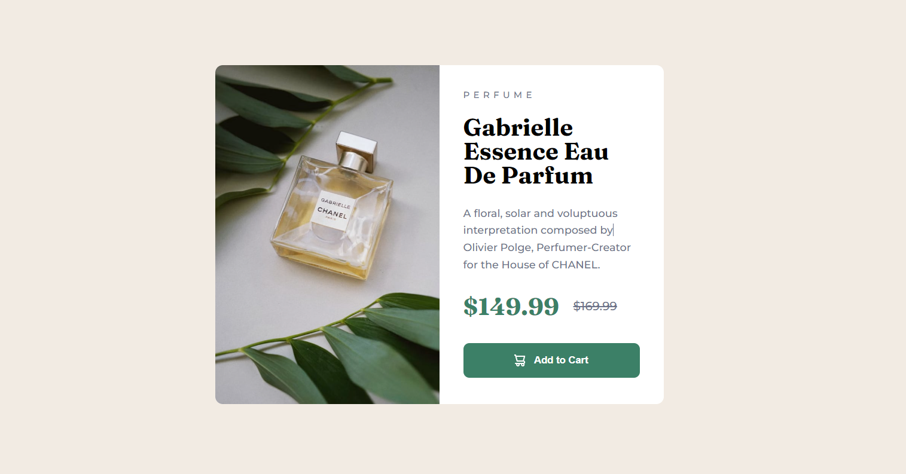

# Frontend Mentor - Product preview card component solution

This is a solution to the **[Product preview card component challenge on Frontend Mentor](https://www.frontendmentor.io/challenges/product-preview-card-component-GO7UmttRfa)** by **[Dacardonac](https://github.com/Dacardonac)**. Frontend Mentor challenges help you improve your coding skills by building realistic projects.

## Table of contents

- [Frontend Mentor - Product preview card component solution](#frontend-mentor---product-preview-card-component-solution)
  - [Table of contents](#table-of-contents)
  - [Overview](#overview)
    - [The challenge](#the-challenge)
    - [Screenshot](#screenshot)
    - [Links](#links)
  - [My process](#my-process)
    - [Built with](#built-with)
    - [What I learned](#what-i-learned)
    - [Continued development](#continued-development)
    - [Useful resources](#useful-resources)
  - [Author](#author)
  - [Acknowledgments](#acknowledgments)

## Overview

### The challenge

Users should be able to:

- View the optimal layout depending on their device's screen size
- See hover and focus states for interactive elements

### Screenshot



Add a screenshot of your solution. The easiest way to do this is to use Firefox to view your project, right-click the page and select "Take a Screenshot". You can choose either a full-height screenshot or a cropped one based on how long the page is. If it's very long, it might be best to crop it.

Alternatively, you can use a tool like [FireShot](https://getfireshot.com/) to take the screenshot. FireShot has a free option, so you don't need to purchase it.

Then crop/optimize/edit your image however you like, add it to your project, and update the file path in the image above.

**Note: Delete this note and the paragraphs above when you add your screenshot. If you prefer not to add a screenshot, feel free to remove this entire section.**

### Links

- Solution URL: [Add solution URL here](https://your-solution-url.com)
- Live Site URL: [Add live site URL here](https://your-live-site-url.com)

## My process

### Built with

- Semantic HTML5 Markup
- CSS3 Custom Properties
- Flexbox
- CSS Grid
- Mobile-first Workflow
- [Vite](https://vitejs.dev/) - Frontend Tooling
- [Sass/Scss](https://sass-lang.com/) - Modules


### What I learned

Use this section to recap over some of your major learnings while working through this project. Writing these out and providing code samples of areas you want to highlight is a great way to reinforce your own knowledge.

To see how you can add code snippets, see below:

```html
<h1>Some HTML code I'm proud of</h1>
```
```css
.proud-of-this-css {
  color: papayawhip;
}
```
```js
const proudOfThisFunc = () => {
  console.log('🎉')
}
```

### Continued development

I want to continue learning more about Responsive, BEM methodology and perfect the technique in aspects like name the classes, also I want to improve in modularize the component's styles with Sass and learn about Conventional Commits

### Useful resources

- **[MDN](https://developer.mozilla.org/en-US/)** - This helped me with **Documentation** on many topics, mostly with **HTML** and **CSS** properties.
- **[ChatGPT](https://chatgpt.com/)** - This is an incredible **Artificial Intelligence (AI)** tool, **ChatGPT** helps me with **specific topics**, **errors in the project** and **investigations**.

## Author

- Frontend Mentor - **[@Dacardonac](https://www.frontendmentor.io/profile/Dacardonac)**
- LinkedIn - **[@Daniel Alejandro Cano Cardona](https://www.linkedin.com/in/daniel-alejandro-cano-cardona/)**


## Acknowledgments

I want to thank **[Jairovg](https://github.com/jairovg)** for the teachings and his help to complete this challenge in a good way and with good practices.
